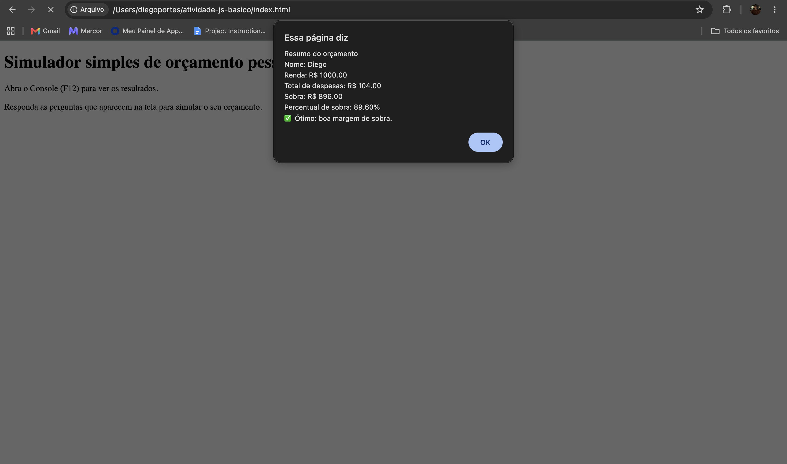

# Atividade Prática - JavaScript básico

Simulador simples de orçamento pessoal, feito com variáveis, tipos básicos, operadores,
`if / else`, `for` e `while`.

## Identificação

- **Nome:** Diego Leite Portes Caetano
- **Matrícula:** 933458

## Como executar

1. Abra o arquivo `index.html` no navegador.
2. Abra o Console do DevTools (F12) na aba **Console**.
3. Responda as perguntas que aparecem nos `prompt()`.
4. O resumo aparece em um `alert()` e também no Console.

## O que o script faz

- Pergunta o nome (string), a renda mensal (number) e a quantidade de despesas (number).
- Limita a quantidade de despesas entre 1 e 5.
- Valida toda entrada numérica com `while`, `Number()` e `isNaN()`, repetindo o prompt
  enquanto o valor não for um número válido.
- Soma as despesas dentro de um `for`.
- Classifica o orçamento com `if / else`:
  - despesas maiores que a renda: "⚠️ Atenção: você gastou mais do que ganhou."
  - sobra maior ou igual a 30% da renda: "✅ Ótimo: boa margem de sobra."
  - demais casos: "🙂 Ok: dá para melhorar a sobra."
- Exibe nome, renda, total de despesas e sobra com duas casas decimais, no `alert()` e no
  `console.log()`.

## Execução no Console do navegador

## Arquivos

- `index.html`: página que carrega o script.
- `script.js`: lógica do simulador.
